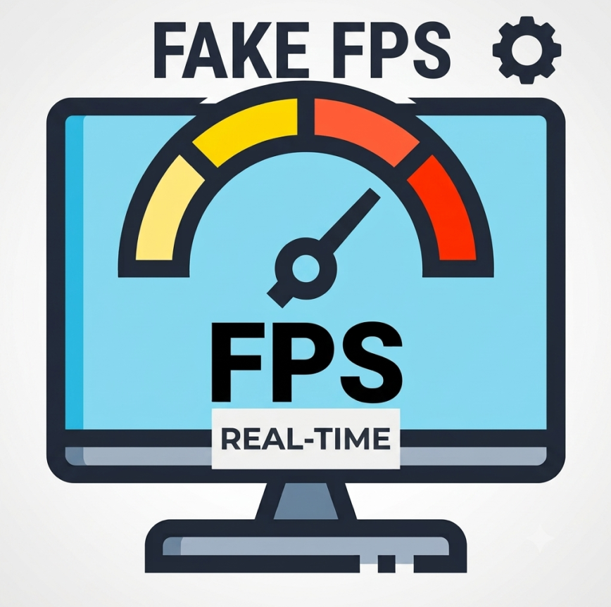

# Fake Fps +



Fake your FPS with ease — static or random values, configurable in-game. Works with Sodium and any FPS counter mod.

## Downloads

| Minecraft Version | Mod File |
|------------------|----------|
| 1.21.11 | `v1_21_11/build/libs/fakefps-1.21.11-1.0.0.jar` |
| 26.1 | `v26_1/build/libs/fakefps-26.1-1.0.0.jar` |
| 26.1.1 | `v26_1_1/build/libs/fakefps-26.1.1-1.0.0.jar` |
| 26.1.2 | `v26_1_2/build/libs/fakefps-26.1.2-1.0.0.jar` |
| 26.2 | `v26_2/build/libs/fakefps-26.2-1.0.0.jar` |

## Features

- **F6** — Open configuration GUI
  - Static mode: set a fixed FPS value
  - Random mode: FPS fluctuates between min/max range
- **F7** — Toggle mod on/off in-game
- **1-second cooldown** on random values (vanilla-like feel)
- **Persistent config** — settings save automatically and persist across restarts
- Works with **Sodium**, **Iris**, and any FPS counter mod (F3, Lunar, etc.)

## Installation

1. Install **Fabric Loader** for your Minecraft version
2. Install **Fabric API**
3. Download the JAR matching your Minecraft version
4. Place it in your `mods` folder

## Java Agent (Lunar Client / Feather Client / Badlion)

An experimental Java Agent is included for non-Fabric clients:

```
-javaagent:fakefps-agent-1.0.0.jar
```

Add the above to your JVM arguments. The agent supports the same F6/F7 controls and includes a Swing-based configuration GUI.

> **Note:** The agent is a compile-only artifact. ASM must be available on the classpath at runtime.

## Building from Source

```bash
./gradlew build
```

JARs are output to each module's `build/libs/` directory.

## License

MIT — see [LICENSE](LICENSE). Copyright (c) 2026 Mayank (Afkz Digitals)
